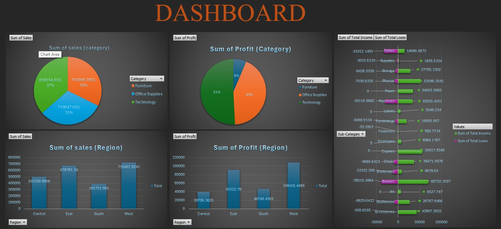
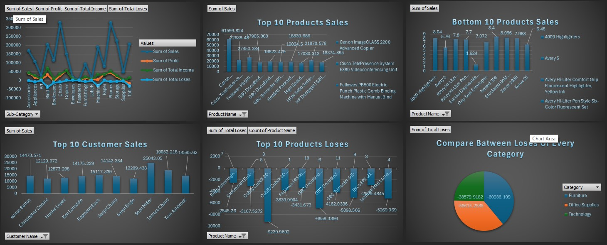
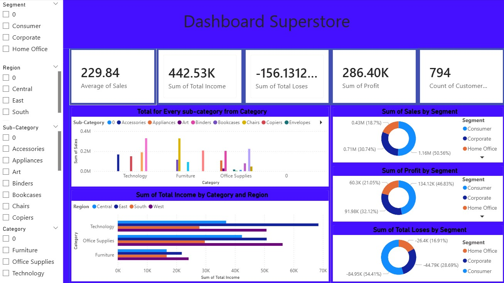

# Superstore Sales Analysis

## 📌 Project Overview

This project presents a sales and profitability analysis of the Superstore dataset using **Microsoft Excel** and **Power BI**.

The analysis focuses on understanding sales performance, profitability, losses, product performance, customer segments, categories, sub-categories, and regional performance.

The project combines detailed Excel-based analysis using Pivot Tables and Pivot Charts with an interactive Power BI dashboard to transform raw sales data into meaningful business insights.

---

## 🎯 Project Objectives

The main objectives of this project are to:

- Analyze overall sales and profitability.
- Identify the best and worst-performing products.
- Compare sales and profit across different categories and sub-categories.
- Analyze regional sales and profitability.
- Understand customer segment performance.
- Identify areas generating high profits and high losses.
- Provide visual insights that can support better business decisions.

---

## 🛠️ Tools Used

- **Microsoft Excel**
  - Data preparation
  - Calculated columns
  - Pivot Tables
  - Pivot Charts

- **Microsoft Power BI**
  - Data visualization
  - KPI Cards
  - Interactive business dashboard
  - Category, region, and customer segment analysis

---

## 📂 Project Structure

```text
Superstore-Sales-Analysis
│
├── Data
│   └── Superstore.csv
│
├── Excel
│   └── Superstore_Analysis.xlsx
│
└── PowerBI
    └── Superstore_Dashboard.pbix
```

---

## 📊 Dataset

The Superstore dataset contains transactional sales information, including:

- Order and shipping information
- Customer information
- Geographic information
- Product categories and sub-categories
- Sales
- Quantity
- Discount
- Profit

### Main Columns

| Column | Description |
|---|---|
| Order ID | Unique identifier for each order |
| Order Date | Date when the order was created |
| Ship Date | Date when the product was shipped |
| Ship Mode | Shipping method |
| Customer ID | Customer identifier |
| Customer Name | Customer name |
| Segment | Customer segment |
| Country | Country |
| City | Delivery city |
| State | Delivery state |
| Postal Code | Postal code |
| Region | Geographic region |
| Product ID | Product identifier |
| Category | Main product category |
| Sub-Category | Product sub-category |
| Product Name | Product name |
| Sales | Sales amount |
| Quantity | Number of units sold |
| Discount | Discount applied |
| Profit | Profit or loss generated from the transaction |

---

## 🧹 Data Preparation

Several calculated columns were created in Excel to support the analysis.

### Price per Unit

A new **Price per Unit** column was created to calculate the average selling price per unit:

```text
Price per Unit = Sales ÷ Quantity
```

### Income

The **Income** column contains only positive profit values.

It represents transactions that generated a profit.

### Losses

The **Losses** column contains negative profit values.

It represents transactions that generated a loss.

Separating income and losses made it easier to analyze profitability and identify areas with significant losses.

---

# 📗 Excel Analysis

Microsoft Excel was used for detailed data analysis through **Pivot Tables** and **Pivot Charts**.

### Regional Analysis

Pivot Tables were created to analyze:

- Total Sales by Region
- Total Profit by Region

This helped compare regional performance and identify regions with stronger or weaker results.

### Product Analysis

The analysis included:

- Top 10 best-selling products
- Bottom 10 products by sales
- Top 10 most profitable products
- Products generating the highest losses

### Category Analysis

Sales and profitability were analyzed across the three main categories:

- Furniture
- Office Supplies
- Technology

### Sub-Category Analysis

Sub-categories were analyzed using:

- Sales
- Profit
- Income
- Losses

This provided a more detailed view of product performance.

### Customer Analysis

Customer-level analysis was performed to identify:

- Top customers by sales
- Customers generating high profits
- Customers associated with significant losses

---

# 📈 Excel Visualizations

Several Pivot Charts were created to visualize the analysis, including:

- Category vs. Sales
- Category vs. Profit
- Category Losses
- Region vs. Sales
- Region vs. Profit
- Sub-Category Income and Losses
- Top 10 Products by Sales
- Bottom 10 Products by Sales
- Top 10 Customers by Sales
- Top 10 Products by Losses

## 📸 Excel Analysis Preview

### Excel Dashboard — Part 1



### Excel Dashboard — Part 2




These visualizations provide a clear overview of the company's sales and profitability performance.

---

# 📊 Power BI Dashboard

Power BI was used to transform the analysis into an interactive business dashboard.

## Key Metrics

The dashboard includes the following KPI Cards:

### Average Sales

Represents the average sales value per transaction.

### Total Income

Represents the total positive profit generated from transactions.

### Total Losses

Represents the total losses generated by unprofitable transactions.

### Total Profit

Represents the overall profit generated by the business.

### Number of Customers

Represents the number of customers included in the dataset.

---

## 📊 Dashboard Visualizations

The Power BI dashboard includes:

### Category & Sub-Category Sales

Shows the relationship between categories and sub-categories based on total sales.

### Region & Category Profit

Compares profitability across regions and product categories.

### Segment Sales

Analyzes sales performance across different customer segments.

### Segment Profit

Shows which customer segments contribute the most profit.

### Segment Losses

Highlights customer segments associated with higher losses.


## 📸 Power BI Dashboard Preview




---

## 💡 Business Analysis

The analysis helps answer important business questions such as:

- Which product categories generate the highest sales?
- Which categories generate the highest profit?
- Which regions perform best in terms of sales and profit?
- Which customer segments contribute the most revenue?
- Which customer segments generate higher losses?
- Which products are the best sellers?
- Which products generate the highest profits?
- Which products contribute significantly to losses?
- Which sub-categories require further attention?

These insights can help businesses improve sales strategies, focus on profitable products and customers, and reduce unnecessary losses.

---

## 🔄 Project Workflow

```text
Raw Superstore Data
        ↓
Data Preparation
        ↓
Calculated Columns
        ↓
Excel Pivot Tables
        ↓
Excel Pivot Charts
        ↓
Business Analysis
        ↓
Power BI Dashboard
        ↓
Business Insights
```

---

## 🚀 Project Outcome

This project demonstrates an end-to-end approach to analyzing retail sales data using **Excel and Power BI**.

It combines data preparation, exploratory analysis, business-focused calculations, Pivot Tables, data visualization, KPI reporting, and interactive dashboard development to provide a comprehensive view of Superstore sales and profitability performance.